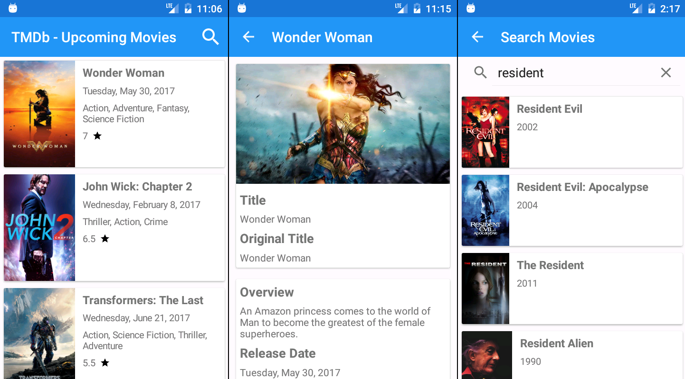
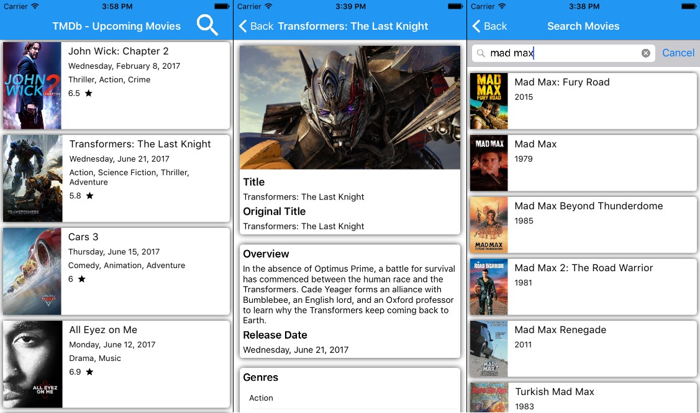
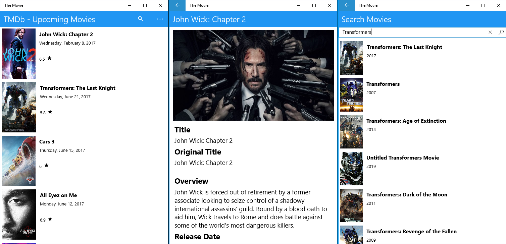

# The Movie Xamarin
Cross-platform application with Xamarin Forms that uses [The Movie Database API 3](https://developers.themoviedb.org/3).

## Third-party libraries
* __Prism Core:__ Used `BindableBase` in ViewModels because of the implementation of INotifyPropertyChanged
* __FFImageLoading:__ Used because of higher performance in loading images
* __Xam.Plugin.Connectivity:__ Used because of verifying connectivity internet

## Screenshots

### Android

### iOS

### UWP

